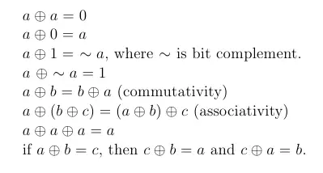

# 📄: 136. Single Number

- https://neetcode.io/practice

# ✅: Solution

- a
  - this image to understand more
  - 
  - ## blog/video on it
    - https://dev.to/13point5/single-number-1agd
    - https://www.youtube.com/watch?v=wvVqDkX8U4A&list=PLl0KD3g-oDOHElCF7S7q6CRGz1qG8vQkS&ab_channel=Errichto