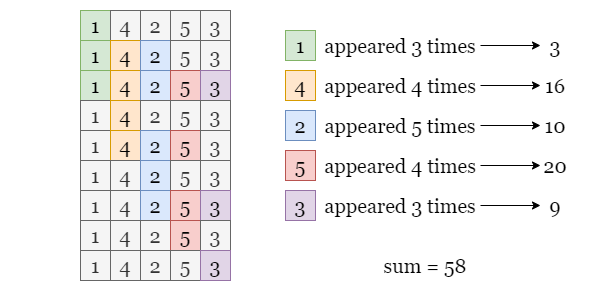

# 📄: 1588. Sum of All Odd Length Subarrays

- https://leetcode.com/study-plan/programming-skills/?progress=x824bvmv

# ✅: Solution

- b ... easy / first logic / understand
  - _b.java ... **faster** in all i solved
-
- check out other possible solution
- aka **fastest** ... ie. d.java
- https://leetcode.com/problems/sum-of-all-odd-length-subarrays/solutions/2773805/sum-of-all-odd-length-subarrays/
-

