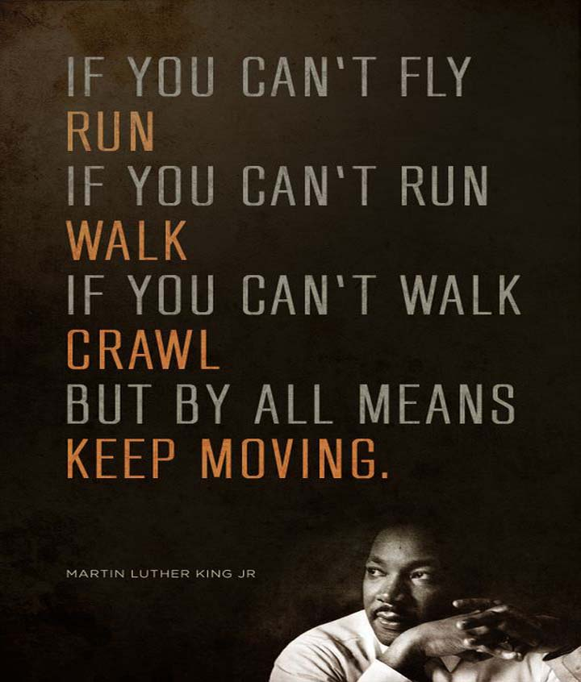

# 💪: Badge


# ⚡: Stats

<!-- [](https://leetcode.com/withrvr/) -->

<a href="https://leetcode.com/withrvr/">
  
</a>

<br>

# 🔗: Links

- Want to see my LeetCode Profile [@withrvr ... Click here](https://leetcode.com/withrvr/)
- Most of the problems which i have solved are from
  - ### [Official Website Study Plan](https://leetcode.com/study-plan/)
    - [LC75 / LeetCode 75](https://leetcode.com/study-plan/leetcode-75/?progress=xuumuo5t)
    - [Programming Skills 1](https://leetcode.com/study-plan/programming-skills/?progress=x824bvmv)
    - [SQL 1](https://leetcode.com/study-plan/sql/?progress=x3n6zbih)
    - .... etc
  - ### [Grind 75 questions by @techinterviewhandbook](https://www.techinterviewhandbook.org/grind75)
    - [same but more 169 questions ... version of it](https://www.techinterviewhandbook.org/grind75?weeks=26&hours=40)
  - ### [neetcode.io blind 75 ... or all of it](https://neetcode.io/practice)
    - [can see its roadmap (which i like to much) can see/follow website](https://neetcode.io/roadmap)

# 🔥: Consistency is the key

- Started solving problem on Leetcode
- From 1-Dec-2022
- At least 1 Problem 1 Day

<!-- ```
IF YOU CAN'T SOLVE-PROBLEM
ATTEMPT-IT
IF YOU CAN'T ATTEMPT-IT
READ-IT
IF YOU CAN'T READ-IT
VISIT-IT
BUT BY ALL MEANS,
KEEP MOVING
``` -->

```
If you can't Solve-Problem
ATTEMPT-IT

If you can't Attempt-It
READ-IT

If you can't Read-It
VISIT-IT

BUT BY ALL MEANS
KEEP MOVING

~

My Inspired Thought from Martin Luther,
for new Coder/don't know shit trying CP
...
LIKE ME i guess
```


<!-- https://www.myincrediblewebsite.com/wp-content/uploads/2017/01/MLK-on-Moving.jpg -->

<br>

# 🧑‍💻: Developer Guide

- . . . . . [Dev_Guide.md](./dev_guide.md)
- who want to see / execute code
- also folder Structure of this repo
